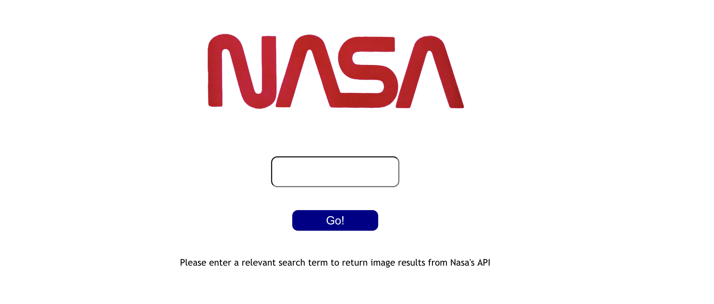

<h1>
Mock React Technical Test 
</h1>

For bootcamp, we were tasked with creating a mock React web application that allows users to search and retrieve images from the NASA image databse through their API.

When a user inputs relevant text such as "moon" or "rocket" into the search area, the relevant images from NASA's image databse will be displayed.

<h2> 
Technologies Used
</h2>

We used a range of technologies for this project including React, Jest, The React Testing Library, CSS and Nasa's API.

<h2>
Screenshot
</h2>

<h2>
Instructions to run the app
</h2>

Please feel free to clone the repo into your terminal. From there, you can run npm start to run the project locally in the browser or use npm test to run the tests 

<h4>
Author and credits 
<h4>

Created by Scott Hannabuss with thanks to Manchester Codes who provided a basic outline on how to create the app, and NASA for allowing access to their api. 

